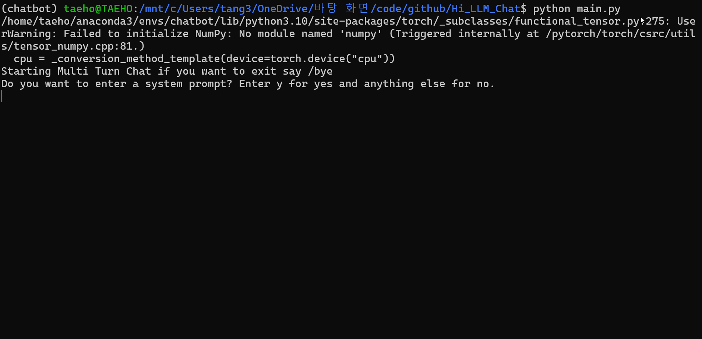

# 💬 Hi_LLM_Chat: On-Device Multi-Turn Chatbot Powered by Llama 3.2 1B

[](https://www.python.org/downloads/)

**Hi_LLM_Chat** is a simple yet powerful multi-turn chatbot that runs entirely on your local machine. It's built upon the **Llama 3.2 1B model** and aims for natural conversations with users. Experience real-time interaction with its **streaming text generation** feature! 🚀

## ✨ Key Features

* **🖥️ 100% Local Execution:** No internet connection or external API calls needed (after model download). Everything is processed on your PC.
* **🔄 Multi-Turn Conversation Support:** Remembers previous parts of the conversation for contextual responses.
* **🦙 Utilizes Llama 3.2 1B Model:** Leverages a capable yet relatively lightweight large language model.
* **💨 Real-time Streaming Output:** Responses appear token-by-token, like someone typing in real-time, making interactions more engaging.
* **🔧 Simple Structure:** Focuses on core chatbot functionality, making it easy to understand and modify.

## 🎬 Demo 

**

## ⚙️ Requirements

* **Python:** 3.10+ recommended
* **Llama 3.2 1B Model Weights & Tokenizer:** You need the official Llama 3.2 1B model weights and associated tokenizer files. Request access and download them from Meta's official channels: [https://llama.meta.com/llama-downloads/](https://llama.meta.com/llama-downloads/) (Follow the instructions on the site).

## ▶️ Usage

This section covers everything from setting up the environment to running the chatbot.

1.  **Clone the Repository:**
    ```bash
    git clone https://github.com/bok3948/Hi_LLM_Chat.git
    cd Hi_LLM_Chat
    ```

2.  **Download Model & Tokenizer:**
    * Obtain the Llama 3.2 1B (Instruct version recommended for chat) model weights and tokenizer from the official Meta channels ([https://llama.meta.com/llama-downloads/](https://llama.meta.com/llama-downloads/)

3.  **Create Directory & Place Model Files:**
    * Create a directory within the cloned repository to store the model files (e.g., create a folder named `llama3.2-1B-instruct`).
    * Place all the downloaded model files (weights, tokenizer, params, etc.) into the directory you just created.
    * **Example Directory Structure:** After placing the files, your project folder should resemble this:
        ```
        Hi_LLM_Chat/
        │
        ├── llama3.2-1B-instruct/     <-- Directory for model files
        │   │
        │   ├── consolidated.00.pth   <-- Example Llama 3.2 weight file(s)
        │   ├── (or *.safetensors)    <-- Alternative weight file format
        │   ├── (or *.gguf)           <-- Example GGUF model file (if using llama.cpp)
        │   │
        │   ├── tokenizer.model       <-- Llama 3.2 tokenizer file
        │   ├── params.json           <-- Model parameters file
        │   └── ...                   <-- Any other files included with the download
        │
        ├── chat.py                   <-- Your main chatbot script (Example name)
        ├── requirements.txt          <-- List of required Python libraries
        ├── config.py                 <-- Optional configuration file (Example name)
        ├── README.md                 <-- This README file
        └── .git/                     <-- Git directory (hidden by default)

4.  **Run the Chatbot:**
    * Open your terminal and execute the main script:
    ```bash
    python chat.py
    ```
    * Example specifying model folder via command-line argument
    ```bash
    python chat.py --model_folder_path ./llama3.2-1B-instruct/
    ```

---
